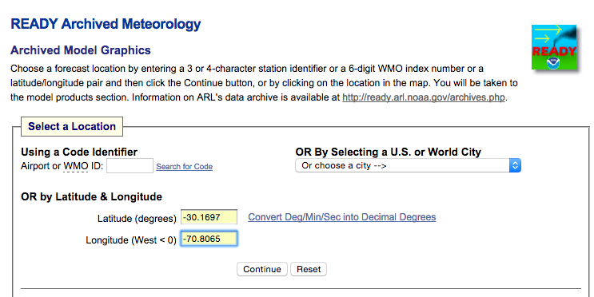
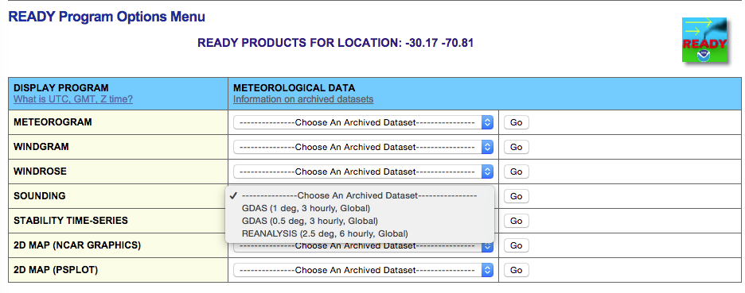
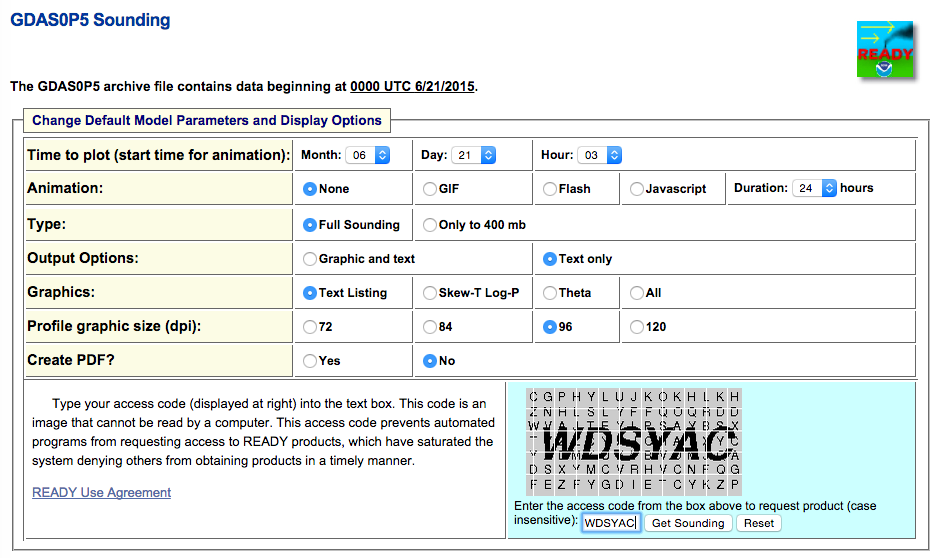

Updating the Atmosphere profile
================================

An atmosphere profile gives the pressure, temperature, and various molecular mixing ratios as
a function of height in the atmosphere. TelFit comes with a default atmosphere profile suitable 
for mid-latitudes at nighttime that works pretty well, but you can do better 
by using a profile tailored to your observatory. There isn't a particularly easy way to do
this, so I will outline the steps I use to get an updated atmosphere profile from the 
`Global Data Assimilation System`_ below. I have included screenshots of the various stages
to aid you in your journey, but you are on your own if the website changes between now and when
you are reading this! 

First, go to the `GDAS`_ website. Enter the latitude and longitude of your observatory, and click 
"continue." 

In the Sounding row, choose the entry titled "GDAS (0.5 deg, 3 hourly, Global)". Hit the
"Go" button in the sounding row.

Choose the appropriate UT date:

On the next page, use the following settings.

  - Choose the appropriate UT time
  - Choose "Text only" in the "Output Options" row.
  - Choose "Text listing" in the "Graphics" row.
  - Complete the captcha (this is why I can't make it easy on you!) hit "Get Sounding"

After all this, you should get a page with a bunch of information. You want to copy-paste the 
second block into a text file. It should look something like this.
::

    PRESS HGT(MSL) TEMP DEW PT  WND DIR  WND SPD
    HPA       M      C     C       DEG     M/S  
    E = Estimated Surface Height

      862.  1377.E
      860.  1397.E  18.1  -10.1    83.9     4.5
      856.  1438.E  19.3  -10.9    82.7     4.5
      850.  1512.E  20.1  -12.0    82.6     3.9
      845.  1565.E  20.3  -12.3    82.6     3.3
      837.  1643.E  20.2  -12.6    86.0     2.7
      829.  1730.E  19.7  -13.3    90.1     2.4
      820.  1833.E  19.3  -13.5    90.2     2.2
      811.  1935.E  18.6  -13.8    90.8     2.2
      799.  2068.E  17.8  -14.0    92.1     1.9
      787.  2201.E  16.9  -14.3    94.8     1.8
      774.  2360.E  15.8  -14.4   106.3     1.6
      760.  2524.E  14.5  -15.3   119.9     1.2
      743.  2723.E  13.1  -15.5   149.0     0.9
      725.  2940.E  11.5  -15.9   201.3     1.0
      706.  3178.E   9.8  -16.0   236.5     1.7
      686.  3442.E   7.8  -16.6   251.4     2.7
      664.  3743.E   5.6  -17.4   257.5     3.7
      641.  4062.E   3.2  -17.9   258.8     4.8
      616.  4415.E   0.4  -18.7   258.5     5.9
      590.  4817.E  -2.4  -19.8   256.3     7.0
      563.  5239.E  -5.6  -21.7   253.2     8.1
      535.  5709.E  -8.9  -23.8   250.3     9.3
      507.  6196.E -12.2  -26.5   249.1    10.9
      478.  6711.E -15.6  -30.7   249.9    12.9
      448.  7247.E -18.8  -35.5   252.1    15.4
      419.  7805.E -22.4  -39.4   252.1    17.8
      390.  8390.E -26.4  -42.2   248.1    19.9
      361.  8999.E -30.9  -45.3   241.9    23.1
      334.  9662.E -35.6  -46.2   238.6    27.8
      307. 10382.E -40.1  -47.9   237.9    33.5
      281. 11142.E -44.2  -50.7   240.2    39.7
      257. 11948.E -48.2  -53.4   242.7    44.4
      233. 12733.E -51.9  -58.6   242.9    48.5
      211. 13481.E -55.3  -64.8   243.0    53.0
      190. 14225.E -58.4  -69.2   243.7    56.3
      171. 14983.E -61.0  -71.6   244.0    53.2
      153. 15728.E -61.3  -75.6   242.9    39.6
      137. 16461.E -61.2  -81.7   246.9    25.6
      121. 17206.E -63.9  -84.5   259.4    20.8
      107. 17968.E -66.4  -85.8   260.4    22.7
       95. 18751.E -67.6  -86.0   251.2    19.6
       83. 19552.E -68.1  -87.0   248.6    17.4
       73. 20374.E -66.4  -86.9   245.5    14.9
       64. 21214.E -64.3  -87.4   246.5     9.6
       55. 22071.E -63.8  -87.4   264.2     7.4
       48. 22948.E -62.3  -87.2   275.4     7.6
       42. 23844.E -60.6  -88.6   276.8     9.5
       36. 24762.E -59.3  -89.4   268.5    10.5
       31. 25702.E -58.3  -89.9   264.9     9.9
       27. 26668.E -57.5  -90.1   269.0     9.4
       23. 27661.E -57.0  -90.2   273.5    10.7
       19. 28687.E -56.3  -89.8   273.2    13.8
       16. 29756.E -54.5  -89.7   271.0    17.7
       14. 30878.E -52.3  -90.1   269.2    22.4
       12. 32062.E -50.1  -90.9   267.3    26.8

We are finally ready to do some Python! Read that text file in using your favorite 
method (I using numpy.loadtxt). You might need to go through and delete the "E" on
every line, and probably delete the first row since it doesn't have all the information.
::

    import numpy as np
    Pres, height, Temp, dew = np.loadtxt(atmosphere_filename,
                                         usecols=(0, 1, 2, 3),
                                         unpack=True)

You could concievably do something with the wind information, but TelFit doesn't use that
so you are on your own. Now, we need to convert the units so that TelFit does the right
thing. Here is some sample code for doing so. Most of it is pretty self-explanatory except
for the conversion from dew point to mixing ratio in ppmv. The equation and constants were 
taken from a compilation of formulas for humidity, available `here`_ (hopefully).
::
    
    # Sort the arrays by height.
    sorter = numpy.argsort(height) 
    height = height[sorter]
    Pres = Pres[sorter]
    Temp = Temp[sorter]
    dew = dew[sorter]

    #Convert dew point temperature to ppmv
    Pw = 6.116441 * 10**(7.591386*Temp/(Temp + 240.7263)) 
    h2o = Pw / (Pres-Pw) * 1e6

    #Unit conversion
    height /= 1000.0 
    Temp += 273.15

Now, you can tell TelFit about the new atmosphere with the following commands.
I'll assume "fitter" is an instance of the "TelluricFitter" class. The "Modeler"
class has the same method if you just want to make a model.
::

    fitter.EditAtmosphereProfile("Temperature", height, Temp)
    fitter.EditAtmosphereProfile("Pressure", height , Pres) 
    fitter.EditAtmosphereProfile("H2O", height , h2o)

.. _Global Data Assimilation System:  http://ready.arl.noaa.gov/READYamet.php
.. _GDAS:  http://ready.arl.noaa.gov/READYamet.php
.. _here:  http://www.vaisala.com/Vaisala%20Documents/Application% 20notes/Humidity_Conversion_Formulas_B210973EN-F.pdf